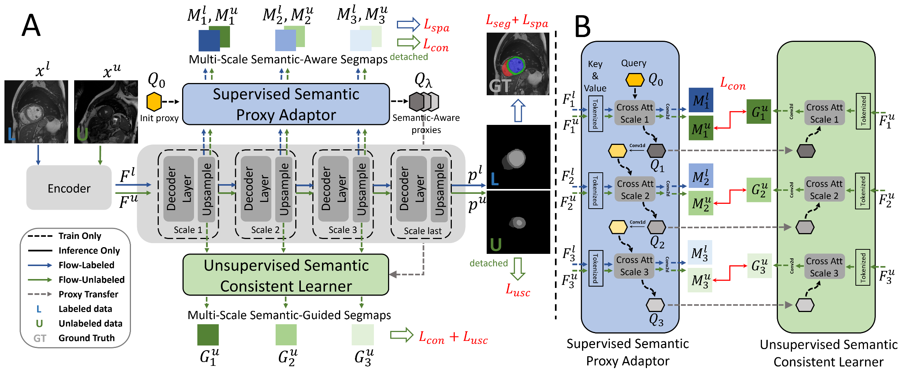

# Inherent Consistent Learning for Accurate Semi-supervised Medical Image Segmentation
The official repo for [MIDL'23 Oral] "Inherent Consistent Learning for Accurate Semi-supervised Medical Image Segmentation"
# Introduction
We propose a novel Inherent Consistent Learning (ICL) method, which aims to learn robust semantic category representations through the semantic consistency guidance of labeled and unlabeled data to help segmentation.
# Methods

## Environment Setup
<details>
<summary>Installation</summary>

1. Clone the repo

```sh
git clone https://github.com/zhuye98/ICL.git 
cd ICL
```
2. Install torch and torchvision required packages.

Some important required packages include:
* torch == 1.9.1+cu111
* python == 3.7
* SimpleITK == 2.2.0
* monai == 1.0.1
* tensorboardX, numpy, h5py and more, please refer to requirements.txt
</details>

<details>
<summary>Data Preparation</summary>

Download the processed data and put the data in `../data/BraTS2019` or `../data/ACDC`, please read and follow the [README](https://github.com/Luoxd1996/SSL4MIS/tree/master/data/).

</details>

## Run
### Training on ACDC datasets:
```
cd code
# For 2D experiments (unet-based)
python train_inherent_consistent_unet_2D.py --root_path ..data/ACDC --exp ACDC/Unet_ICL --num_classes 4 --labeled_num 3/7

# For 2D experiments (swinunet-based)
python train_inherent_consistent_swinunet_2D.py --root_path ..data/ACDC --exp ACDC/Swin_ICL --num_classes 4 --labeled_num 3/7
```
### Training on BraTS datasets:
```
# For 3D experiments on BraTS (3d unet-based)
python train_inherent_consistent_unet_3D_BraTS.py --root_path ..data/BraTS19 --exp BraTS19/Unet_ICL --num_classes 2 --labeled_num 25/50 --use_ssl_pretrained

# For 3D experiments on BraTS (3d swinunetr-based)
python train_inherent_consistent_swinunetr_3D_BraTS.py --root_path ..data/BraTS19 --exp BraTS19/Unet_ICL --num_classes 2 --labeled_num 25/50 --use_ssl_pretrained
```
### Training on AMOS datasets:
```
# For 3D experiments on AMOS (3d unet-based)
python train_inherent_consistent_unet_3D_AMOS22.py --root_path ..data/AMOS --exp AMOS/Unet_ICL --num_classes 16 --labeled_num 15 --val_num 30
```

### Training on different datasets:
```
python test_2D_ACDC.py / test_3D_AMOS.py / test_3D_BraTS
```

## Acknowledgements
Our code is origin from SSL4MIS. We are grateful to these authors for their valuable contributions, and I am hopeful that our newly proposed method can also contribute to advancing related Semi-supervised Learning research.
